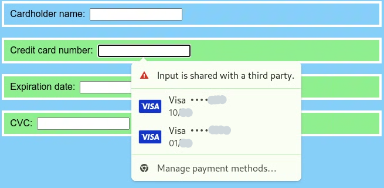

# Policy-controlled feature `autofill`

## Motivation

User input on the Web platform is origin-agnostic: any document, even a third party one, can receive input like clicks or keys – not even the embedding document can prevent that. When the user cannot recognize third-party content as such, e.g., because it lacks visual separation as it often does with borderless iframes, this bears the risk of inadvertently disclosing sensitive information to untrusted third parties.

The underlying problem is that the user’s trust in the top-level document implicitly propagates to third-party embeddees. We propose to break this propagation and make the embedder responsible for delegating the ability to receive input to trusted embeddees. We introduce two new [policy-controlled features](https://www.w3.org/TR/permissions-policy/#features) for that purpose.

Input can come from different sources: directly from the user via input devices like a mouse or keyboard, or from the user agent when it interacts with the website on behalf of the user. Our proposal focuses on two sources that we consider most susceptible to revealing sensitive information:

* keyboard input (from physical or virtual devices) and
* autofill features, under which we broadly subsume user agents’ features that fill one or multiple form control elements with or without user interactions.

This document addresses the second bullet point. An [affiliated document](manual-text.md) addresses the other bullet point.

This proposal is intended as a step towards a web where text user input is disabled by default in cross-origin subframes.

## Autofill

Many user agents have features for automatically filling forms on behalf of the user. These features can be categorized along the following dimensions:

* Type of data:
  * structured data: e.g., addresses, credentials, or credit cards.
  * unstructured data: e.g., values memorized from past forms.
* Interaction model:
  * no UI: e.g., autofill credentials on page load without user interaction.
  * <a name="def-field-anchored-interaction-model">field-anchored UI</a>: e.g., display suggestions next to the currently focused DOM element.
  * unanchored UI: e.g., show a button outside of the web content area.
* Scope:
  * single field: e.g., autocomplete the currently focused field.
  * fields of a form: autofill potentially multiple fields of the form associated with the currently focused field.
  * fields of the page: autofill fields potentially outside of the current form, potentially in other frames.

## Goals

* Allow user agents to safely extend the scope of autofill across trusted origins.
* Help user agents to warn users before autofilling values into untrusted origins.

## Non-goals

* Extend or limit the scope of autofill depending on the anchor’s origin (in the [field-anchored interaction model](#def-field-anchored-interaction-model)).
* Provide a way of turning autofill off.

## Proposal

We propose a policy-controlled feature `autofill` which recommends the user agent not to autofill into documents where the feature is disabled. The precise semantics is:

If the <a name="def-autofill-feature">policy-controlled feature</a> `autofill` is [disabled](#def-disabled) in a document, the user agent SHOULD NOT [autofill](#def-autofill) a form control element in that document.

The user agent <a name="def-autofill">autofills</a> a set of form control elements when it modifies their [values](https://html.spec.whatwg.org/#concept-fe-value) on behalf of the user.

A [policy-controlled feature](https://www.w3.org/TR/permissions-policy/#features) is <a name="def-disabled">disabled</a> in a document iff the result of executing [Is feature enabled in document for origin?](https://w3c.github.io/webappsec-permissions-policy/#is-feature-enabled) on the feature, the document, and the document’s [origin](https://dom.spec.whatwg.org/#concept-document-origin) is `"Disabled"`.

The [default allowlist](https://www.w3.org/TR/permissions-policy/#default-allowlists) is `'self'`.

## Use-cases

### Example 1: limiting the scope

Cross-origin iframes should often be allowed to present data to, but not to receive data from, the user. For example, consider a news website that embeds a cross-origin advertisement:

```html
<!-- https://news.example.com/frontpage.html -->
<!DOCTYPE html>
<input autocomplete=username>
<input autocomplete=password>
<iframe src=https://ads.example.com/ad.html></iframe>
```

```html
<!-- https://ads.example.com/ad.html -->
<!DOCTYPE html>
<input id=account>
<input id=credentials>
```

It is clearly not desirable for the user to enter their username or password for the news website in the third-party ad frame.

Indeed, `autofill` is disabled in `ad.html` since the document is cross-origin and the default allowlist is `'self'`. (The website can also make this explicit by adding an <code>[allow attribute](https://w3c.github.io/webappsec-permissions-policy/#iframe-allow-attribute)</code> to the <code>iframe</code> element: <code>allow="autofill 'none'"</code>.)

Following the [semantics](#def-autofill-feature) of `autofill`, the user agent should simply exclude the fields in `ad.html` from the scope of any autofill operation.

For the fields in `ad.html`, browsers that employ the [field-anchored interaction model](#def-field-anchored-interaction-model) (as do Chrome, Firefox, Safari) may prefer to display autofill suggestions and include a warning to the user. As an example, such a warning could look as follows:



To prevent major breaking changes, we recommend that user agents ramp up the consequences of `autofill` incrementally. For example, the rollout could proceed in three stages:

1. Autofill as usual but inform the web developer (e.g., in the JavaScript console) if a form control from a document where `autofill` is disabled is in the scope of the autofill.
2. Warning the user if a form control from a document where `autofill` is disabled is in the scope of an autofill.
3. Exclude form controls of documents where `autofill` is disabled from the scope of an autofill.

### Example 2: extending the scope

In some cases, text input is legitimate in cross-origin iframes. A common example are payment forms, which intentionally live in cross-origin iframes to isolate their contents. For example, consider a merchant’s checkout page with a payment form from a third-party payment service provider (PSP):

```html
<!-- https://merchant.example.com/checkout.html -->
<!DOCTYPE html>
<input autocomplete=cc-name>
<iframe src=https://psp.example.com/pay.html allow="autofill manual-text"></iframe>
```

```html
<!-- https://psp.example.com/pay.html -->
<!DOCTYPE html>
<input autocomplete=cc-number>
<input autocomplete=cc-exp>
<input autocomplete=cc-csc>
```

There are two trust relations at play:

*   between the user and the merchant: the user is willing to pay for the merchant’s goods, and
*   between the merchant and the PSP: the merchant leaves the payment processing to the PSP.

The transitive closure may not explicitly hold: the user may not know about the PSP and its role in payment processing.

By enabling `autofill` (and its companion feature `manual-text`) in the `allow` attribute, the merchant enables the user agent to seamlessly autofill the entire credit card form, i.e., the fields in `checkout.html` and `pay.html`.

This mechanism is not limited to a pair of frames. In particular, it also works if the card number, expiration date, and the security code fields are distributed over three separate iframes and `autofill` is enabled in each of them.

### Example 3: multiple origins

Consider the following toy example:

```html
<!-- https://a.example.com/a.html -->
<!DOCTYPE html>
<iframe src=https://b.example.com/b.html allow=autofill></iframe>
<iframe src=https://c.example.com/c.html allow=autofill></iframe>
<iframe src=https://d.example.com/d.html></iframe>
```

```html
<!-- https://{b,c,d}.example.com/{b,c,d}.html -->
<!DOCTYPE html>
<input>
```

A user agent may simultaneously autofill form controls in `{a,b,c}.html` about the different origins because `autofill` is enabled in the three documents. The [next section](#security-and-privacy) demonstrates why `autofill` should be enabled only on trusted origins.

## Security and privacy

Intuitively, `autofill` instructs the user agent that a document can be treated as first-party content for the purposes of autofill. On the one hand, this specification of trust for autofill purposes is intended to help user agents protect the user’s data from being filled in untrusted documents. On the other hand, when `autofill` is enabled in an untrustworthy document, this positive signal to the user agent may be detrimental to data security. This section discusses attack vectors and mitigations.

### Eavesdropping due to overly permissive policies

Enabling `autofill` in untrusted iframes may indirectly expose data to third parties. In the following example, a malicious ad (`ad.html`) tries to eavesdrop on a legitimate payment form (`pay.html`):

```html
<!-- https://merchant.example.com/checkout.html -->
<!DOCTYPE html>
<input autocomplete=cc-name>
<iframe src=https://psp.example.com/pay.html allow=autofill></iframe>
<iframe src=https://ads.example.com/ad.html allow=autofill></iframe>
```

```html
<!-- https://psp.example.com/pay.html -->
<!DOCTYPE html>
<input autocomplete=cc-number>
<input autocomplete=cc-exp>
<input autocomplete=cc-csc>
```

```html
<!-- https://ads.example.com/ad.html -->
<!DOCTYPE html>
<input style="opacity: 0" autocomplete=cc-name>
<input style="opacity: 0" autocomplete=cc-number>
<input style="opacity: 0" autocomplete=cc-exp>
<input style="opacity: 0" autocomplete=cc-csc>
```

User agents should therefore not take `autofill` as license to fill everything. Filling behavior may still need to be specific to the type of data and the involved origins. An obvious example is credentials: origin-bound usernames and passwords should not be autofilled into a cross-origin document. For credit cards, the user agent may run plausibility checks before filling data. An example validity check is that the same credit card number should not be filled in two distinct origins – otherwise, one document may be eavesdropping on the other.

If the embedding document does not trust their own `allow` attributes, they can still override them with the `Permissions-Policy` HTTP header (because a feature [must be enabled](https://w3c.github.io/webappsec-permissions-policy/#algo-define-inherited-policy-in-container) in both the document’s permissions policy and the container policy). For example, `Permissions-Policy: autofill=(self "https://psp.example.com")` prevents all origins except for `https://psp.example.com` from inheriting `autofill`.

**Mitigations:**

* User agents should consider the origin of fields and not, for example, fill credentials in third-party documents.
* Web developers should explicitly allow `autofill` only when needed, and otherwise rely on the default policy.
* Web servers can restrict the policy with an HTTP header.

### Trusted documents embedded in untrusted documents

A fundamental assumption of this proposal is that trust only propagates downwards. This implies that a trusted document’s parent is trusted, too, and as a result, an embedder may be able to eavesdrop on its embeddees like in the [previous section](#eavesdropping-due-to-overly-permissive-policies). The main difference to the previous section is that this case does not require an overly permissive policy.

For example, suppose a malicious website embeds a social media site and the user sees their signed-in state. The user may therefore trust the embeddee and autofill data in the embeddee. With `autofill` enabled in the embedder, the user agent may also include form controls from the embedding document in the scope of the autofill – the embeddee has no means to exclude them.

Arguably, in such a scenario where the embeddee does not prevent being embedded in an iframe (e.g., with the `X-Frame-Options` header or the `frame-ancestors` CSP), clickjacking is a greater problem than potential eavesdropping. Also, like in the [previous section](#eavesdropping-due-to-overly-permissive-policies), the suggested plausibility checks limit the type of data that could be exposed to the parent document.

A fundamental fix would be to make `autofill` opt-in: the embedded document would specify which origins it is willing to inherit `autofill` from. That in turn would require the embeddee to list all legitimate embedders, which is not feasible for, e.g., payment service providers.

**Mitigations:**

* Web pages should limit which parents may embed them in an iframe.
* Blocking third-party cookies reduces the chance of the user being signed in in an cross-origin iframe.
* User agents should consider the origin of fields; for example, they should not fill credentials in third-party documents.

### Clickjacking

An attacker who controls the top-level document can use the policy-controlled feature `autofill` to trick the user into unknowingly filling a third-party form, e.g., to transfer money: The attacker embeds an invisible iframe that loads a cross-origin payment form and tricks the user into autofilling a form in the parent document. Due to `autofill`, the user agent may also autofill the embedded document. Next, the attacker clickjacks the user into submitting the embedded form.

An attacker can likely do the same damage without `autofill`. Firstly, they could clickjack the user into (auto)filling the embedded form directly. Secondly, this attack is arguably only relevant when the attacker wants to submit the form from the victim’s machine. If the attacker merely wants to steal the victim’s autofill data, they manipulate the embedding document directly.

This scenario is a special case of a (purposefully) [overly permissive policy](#eavesdropping-due-to-overly-permissive-policies), so the same mitigations apply.

**Mitigations:**

* User agents should consider the origin of fields and not, for example, fill credentials in third-party documents.
* Web pages should limit which parents may embed them in an iframe.
* Web servers can restrict the policy with a HTTP header.

## Relationship of `autofill` and `manual-text`

Whereas text input is directed at the unique currently focused element, a user agent may autofill multiple fields simultaneously. This leads to a subtle difference in the policy-controlled features:

```html
<!DOCTYPE html>
<iframe src=https://example.com/a.html allow="autofill manual-text"></iframe>
<iframe src=https://example.com/b.html allow="autofill manual-text"></iframe>
```

```html
<!-- https://example.com/{a,b}.html -->
<!DOCTYPE html>
<input>
```

If `autofill` is enabled in two documents `a.html` and `b.html`, the user agent may simultaneously fill form controls in both documents. In user agents where the autofill interaction model is [anchored to a field](#def-field-anchored-interaction-model) (as is the case in, e.g., Chrome, Firefox, Safari), this means an autofill anchored to a form control in `a.html` may also fill form controls in `b.html`.

If `manual-text` is enabled in both documents, it merely means the user can type (etc.) in `a.html` and in `b.html` – but typing in either document won’t affect the other document.
