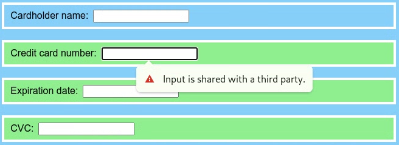

# Policy-controlled feature `manual-text`

## Motivation

User input on the Web platform is origin-agnostic: any document, even a third party one, can receive input like clicks or keys – not even the embedding document can prevent that. When the user cannot recognize third-party content as such, e.g., because it lacks visual separation as it often does with borderless iframes, this bears the risk of inadvertently disclosing sensitive information to untrusted third parties.

The underlying problem is that the user’s trust in the top-level document implicitly propagates to third-party embeddees. We propose to break this propagation and make the embedder responsible for delegating the ability to receive input to trusted embeddees. We introduce two new [policy-controlled features](https://www.w3.org/TR/permissions-policy/#features) for that purpose.

Input can come from different sources: directly from the user via input devices like a mouse or keyboard, or from the user agent when it interacts with the website on behalf of the user. Our proposal focuses on two sources that we consider most susceptible to revealing sensitive information:

* keyboard input (from physical or virtual devices) and
* autofill features, under which we broadly subsume user agents’ features that fill one or multiple form control elements with or without user interactions.

This document addresses the first bullet point. An [affiliated document](autofill.md) addresses the other bullet point.

This proposal is intended as a step towards a web where text user input is disabled by default in cross-origin subframes.

## Goals

* Help user agents to warn users before entering text into untrusted origins.

## Non-goals

* Suppress non-text keys like arrow or control keys.
* Suppress non-text input such as clicks, taps, swipe patterns, or JavaScript virtual keyboards.

## Proposal

We propose a policy-controlled feature `manual-text` which recommends the user agent to suppress text input in documents where the feature is disabled. The precise semantics is:

If the <a name="def-manual-text">policy-controlled feature</a> `manual-text` is [disabled](#def-disabled) in a document, the user agent SHOULD NOT [dispatch](https://dom.spec.whatwg.org/#concept-event-dispatch) any [text-producing](#def-text-producing) event in that document.

An event is <a name="def-text-producing">text-producing</a> iff it is [trusted](https://w3c.github.io/uievents/#trusted-events) and its [type](https://w3c.github.io/uievents/#event-types-list) is one of `beforeinput`, `input`, `keydown`, `keyup`, `keypress`, `compositionstart`, `compositionupdate`, `compositionend`, `drop`, `paste` and, if it is a key event, the [key attribute value](https://w3c.github.io/uievents-key/#key-attribute-value) is a [key string](https://w3c.github.io/uievents-key/#key-string) other than `" "` (Space, `U+0020`).

An event is <a name="def-dispatched">dispatched</a> in a document when it is [dispatched](https://dom.spec.whatwg.org/#concept-event-dispatch) to a target whose [node document](https://dom.spec.whatwg.org/#concept-node-document) is that document.

A [policy-controlled feature](https://www.w3.org/TR/permissions-policy/#features) is <a name="def-disabled">disabled</a> in a document iff the result of executing [Is feature enabled in document for origin?](https://w3c.github.io/webappsec-permissions-policy/#is-feature-enabled) on the feature, the document, and the document’s [origin](https://dom.spec.whatwg.org/#concept-document-origin) is `"Disabled"`.

The [default allowlist](https://www.w3.org/TR/permissions-policy/#default-allowlists) is `'self'`.

## Text-producing events

The [definition](#def-text-producing)’s intention is to denylist all specified events that produce characters, but to tolerate keys that are often used for navigation and similar non-text-producing actions.

In particular, [control keys](https://w3c.github.io/uievents-key/#keys-modifier) like `"Control"`, `"Alt"`, `"Shift"` and [navigation keys](https://w3c.github.io/uievents-key/#keys-navigation) like `"ArrowUp"`, `"ArrowDown"` do not qualify as text-producing events (because these values are not [key strings](https://w3c.github.io/uievents-key/#key-string) but [named key attribute values](https://www.w3.org/TR/uievents-key/#named-key-attribute-value)).

As somewhat special cases, the definition also tolerates `" "` (Space, `U+0020`) and `"Enter"` and `"Tab"`. The motivation here is that even though these keys produce characters, by themselves they do not reveal meaningful text and their [specified](https://w3c.github.io/uievents/#keydown) default actions are essential for keyboard-based browsing.

Many browsers attach custom default behavior to ordinary characters if a modifier is pressed. For example, `"P"` with `"Control"` held down commonly brings up a print dialog. These key events still qualify as text-producing because a malicious website could trick the user into holding down `"Control"` while typing and [cancels](https://dom.spec.whatwg.org/#set-the-canceled-flag) the default events.

## Use-cases

### Disabling text input

Cross-origin iframes should often be allowed to present data to the user, but not to receive data from the user. For example, consider a news website that embeds a cross-origin advertisement:

```html
<!-- https://news.example.com/frontpage.html -->
<!DOCTYPE html>
<input autocomplete=username>
<input autocomplete=password>
<iframe src=https://ads.example.com/ad.html></iframe>
```

```html
<!-- https://ads.example.com/ad.html -->
<!DOCTYPE html>
<input id=account>
<input id=credentials>
```

It is clearly not desirable for the user to enter their username or password for the news website in the third-party ad frame.

Indeed, `manual-text` is disabled in `ad.html` since the document is cross-origin and the default allowlist is `'self'`. (The website can also make this explicit by adding an <code>[allow attribute](https://w3c.github.io/webappsec-permissions-policy/#iframe-allow-attribute)</code> to the <code>iframe</code> element: <code>allow="manual-text 'none'"</code>.)

Therefore, a user agent should not [dispatch](#def-dispatched) [text-producing events](#def-text-producing) events – e.g., text input from the keyboard – in `ad.html`.

Browsers may prefer to display autofill suggestions and include a warning to the user. As an example, such a warning could look as follows:



To prevent major breaking changes, we recommend that user agents ramp up the consequences of `manual-text `incrementally. For example, the rollout could proceed in three stages:

1. Dispatch text-producing events but inform the web developer (e.g., in the JavaScript console) if `manual-text` is disabled.
2. Dispatch text-producing events but warn the user if `manual-text` is disabled.
3. Do not dispatch text-producing events if `manual-text` is disabled.

### Enabling text input

In some cases, text input is legitimate in cross-origin iframes. A common example are payment forms, which intentionally live in cross-origin iframes to isolate their contents. For example, consider a merchant’s checkout page with a payment form from a third-party payment service provider (PSP):

```html
<!-- https://merchant.example.com/checkout.html -->
<!DOCTYPE html>
<input autocomplete=cc-name>
<iframe src=https://psp.example.com/pay.html allow="autofill manual-text"></iframe>
```

```html
<!-- https://psp.example.com/pay.html -->
<!DOCTYPE html>
<input autocomplete=cc-number>
<input autocomplete=cc-exp>
<input autocomplete=cc-csc>
```

There are two trust relations at play:

* between the user and the merchant: the user is willing to pay for the merchant’s goods, and
* between the merchant and the PSP: the merchant leaves the payment processing to the PSP.

The transitive closure may not explicitly hold: the user may not know about the PSP and its role in payment processing.

By enabling `manual-text` (and its companion feature `autofill`) in the `allow` attribute, the merchant enables the user to type in the credit card form, i.e., the fields in `checkout.html` and `pay.html`.

## Security and privacy

`manual-text` is expected to strictly improve security and privacy on the web by protecting users from entering text in untrusted documents.

## Relationship of `autofill` and `manual-text`

Whereas text input is directed at the unique currently focused element, a user agent may autofill multiple fields simultaneously. This leads to a subtle difference in the policy-controlled features:

```html
<!DOCTYPE html>
<iframe src=https://example.com/a.html allow="autofill manual-text"></iframe>
<iframe src=https://example.com/b.html allow="autofill manual-text"></iframe>
```

```html
<!-- https://example.com/{a,b}.html -->
<!DOCTYPE html>
<input>
```

If `autofill` is enabled in two documents `a.html` and `b.html`, the user agent may simultaneously fill form controls in both documents. In user agents where the autofill interaction model is anchored to a field (as is the case in, e.g., Chrome, Firefox, Safari), this means an autofill anchored to a form control in `a.html` may also fill form controls in `b.html`.

If `manual-text` is enabled in both documents, it merely means the user can type (etc.) in `a.html` and in `b.html` – but typing in either document won’t affect the other document.
